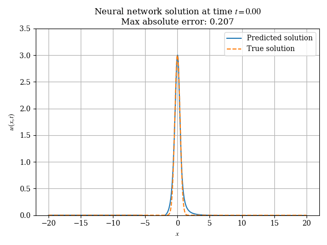
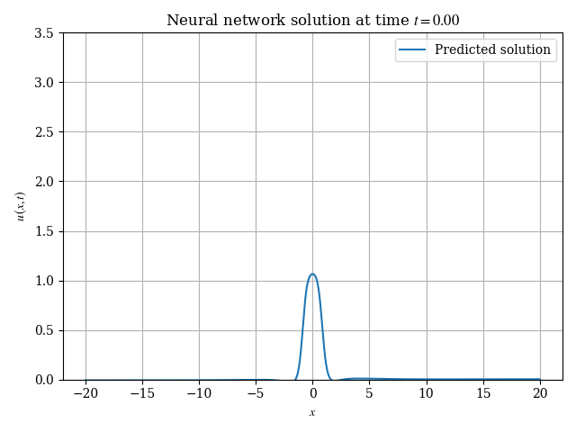

# Using Physics-Informed Neural Networks to solve Partial Differential Equations

This is the accompanying code and supplemental information for the (as-yet unpublished) paper [_An Educational Demonstration Of Using Neural Networks To Solve Partial Differential Equations_](./paper.pdf). See the [provided Jupyter notebook](./Reference.ipynb) for more details.

## Results

**Solution to the linear wave equation** $u_{tt} = c^2 u_{xx}$

**Solution to the nonlinear wave equation** $u_{tt} = c^2 u_{xx} + \varepsilon u^2$
